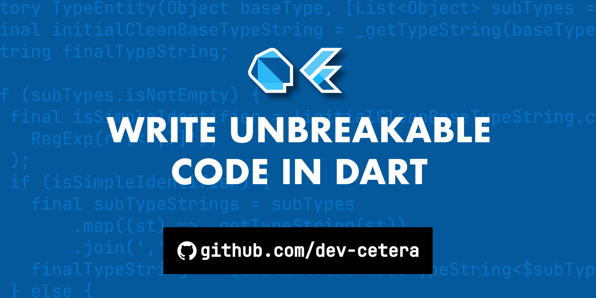

<a href="https://www.buymeacoffee.com/dev_cetera" target="_blank"></a>
<a href="https://discord.gg/gEQ8y2nfyX" target="_blank"></a>

Dart & Flutter Packages by dev-cetera.com & contributors.

[](https://github.com/sponsors/dev-cetera)
[](https://www.patreon.com/c/RobertMollentze)
[](https://pub.dev/packages/df_safer_dart)
[](https://github.com/dev-cetera/df_safer_dart/tree/v0.17.0)
[](https://raw.githubusercontent.com/dev-cetera/df_safer_dart/main/LICENSE)

---

<!-- BEGIN _README_CONTENT -->



In mission-critical software, every potential failure must be accounted for. We write defensive code, check for nulls, and handle exceptions. However, standard Dart tools like **try-catch** and **nullable** types place the burden of safety entirely on the developer. It's easy to forget a check or miss an exception, leading to runtime failures in production—exactly where they are least acceptable.

☝️ **This is a reliability problem.**

## 🧠 The Philosophy: Paternalistic Safety for Mission-Critical Code

`df_safer_dart` is intentionally paternalistic. Drawing heavy inspiration from Rust's safety-first philosophy, it operates on the principle that the compiler should be your primary partner in preventing errors. It's not about being "functional"; it's about making your code predictable and reliable at scale.

While powerful functional libraries like `fpdart` and `dartz` provide excellent tools for safety, they often place the ultimate burden of correct implementation on the developer. An unhandled exception within a mapping function can still lead to a runtime crash if not handled with perfect discipline.

`df_safer_dart` takes a stricter, more opinionated stance. It is architected to absorb common failure points, automatically converting runtime exceptions into manageable `Err` states and passing errors down a "chain". The goal is to shift the burden of safety from developer discipline to the library's core design.

The library achieves this through only three core types (`Option`, `Result`, and `Resolvable`) that wrap failable operations. This lets you write clean, linear code that describes the "happy path," confident that the type system is handling the messy details of nulls, exceptions, and asynchronicity.

## 🚀 Getting Started

For an introduction, please refer to this article:

- **MEDIUM.COM** [Write Unbreakable Code in Dart](https://medium.com/@dev-cetera/write-unbreakable-code-in-dart-8076e62346b5)
- **DEV.TO** [Write Unbreakable Code in Dart](https://dev.to/dev_cetera/write-unbreakable-code-in-dart-njh)
- **GITHUB** [Write Unbreakable Code in Dart](https://github.com/dev-cetera/df_safer_dart/blob/main/ARTICLE.md)

## ✨ Core Features & Design

- **Automatic Exception Handling:** `Result` and `Resolvable` have built-in exception handling. An unexpected throw within your logic won't crash your entire operation chain; it will be automatically caught and converted into an `Err` state. This provides a "crash-proof" resilience against common mistakes that even other safety libraries might not prevent.
- **Airtight Sync/Async Boundaries:** Dart's `Future` and `FutureOr` can be error-prone if misused. This library addresses these challenges with its `Resolvable` type, which splits into `Sync` or `Async` branches. By enforcing compile-time checks, it prevents using a `Future` in a synchronous context or forgetting to `await` a `Future` in an asynchronous context, ensuring structural correctness.
- **Compile-Time Null Safety:** The `Option` type makes the absence of a value an explicit state (`None`) that your code must handle, eradicating null pointer exceptions at their source.
- **A Unified API:** While `Option`, `Result`, and `Resolvable` are distinct, they all inherit from a common base class. This is an implementation detail that allows them to share a consistent, predictable API for core methods, making the library easy to learn and use.
- **Ergonomic Helpers & Utilities:** To make working with the core types seamless, the library includes a rich set of extensions and utilities with minimal boilerplate. These helpers allow you to safely handle collections (firstOrNone), manage nested types (flatten, swap), and convert data (e.g. `letIntOrNone`), all while reducing boilerplate and keeping your business logic clean and linear. Do refer to the [API reference](https://pub.dev/documentation/df_safer_dart/) for more information.

## 🤷 When to Use/Not Use

`df_safer_dart` is a specialized tool. The goal is not to use it everywhere, but to use it where it matters most.

### Use it for:

✔️ **Core Business Logic:** Make complex rules safe and auditable by forcing every step to be explicitly handled.

✔️ **Data Parsing & Validation:** Create a secure boundary between untrusted external data (like JSON) and your application.

✔️ **Network & Database Interactions:** Model expected failures like timeouts as manageable data, not runtime exceptions.

✔️ **Authoring Reliable Packages:** Provide a crash-proof public API for other developers that doesn't rely on try-catch.

✔️ **Mission-Critical Modules:** Ensure any operation where a partial success is dangerous either completes fully or fails cleanly.

### Do Not Use it for:

❌ **Simple UI Display Code:** Dart's built-in null-aware operators (??, ?.) are often more concise and sufficient for declarative UI.

❌ **Rapid Prototyping:** When the goal is maximum iteration speed, the deliberate safety constraints can be unnecessary overhead.

❌ **Performance-Critical "Hot Paths":** In tight loops or micro-optimization scenarios where the minimal overhead of wrapper objects is a primary concern.

❌ **Deeply Exception-Based Frameworks:** In codebases architecturally dependent on exceptions for control flow, as it may feel like fighting the current.

## 📦 The Core Types for Unbreakable Code

`df_safer_dart` is built on three core types that work seamlessly together:

- `Result<T>`: **For Operations That Can Fail**

  Represents the outcome of an operation. It will be either:

  - `Ok<T>`: Contains the success value.
  - `Err<T>`: Contains a detailed, traceable error object.

`Result` transforms exceptions from runtime surprises into predictable data, forcing you to handle failure as an explicit, manageable case.

- `Option<T>`: **For Values That Might Not Exist**

  Represents an optional value. It will be either:

  - `Some<T>`: Contains a present value.
  - `None<T>`: Represents the absence of a value.

`Option` is the ultimate weapon against null pointer exceptions. It makes absence a compile-time concern, not a runtime crash.

- `Resolvable<T>`: **To Unify Sync and Async Logic**

  A powerful wrapper that provides a single, consistent API for operations, regardless of whether they complete instantly or over time. It will be either:

  - `Sync<T>`: For immediate, failable operations. Contains a Result.
  - `Async<T>`: For operations that return a Future, also containing a Result.

`Resolvable` eliminates the mental overhead of branching logic for sync vs. async code, allowing you to build complex, failable workflows with linear, readable chains.

## ⚠️ Enable the Safety Lints (BETA feature)

To get the full benefit of `df_safer_dart`, you must enable its custom linter rules. This is NOT OPTIONAL! It is fundamental to the library's design.

1. Add `custom_lint` and `df_safer_dart_lints` to your `pubspec.yaml`:
```yaml
dependencies:
  df_safer_dart: ^0.16.2

dev_dependencies:
  lints: ^6.0.0
  custom_lint: ^0.7.5
  df_safer_dart_lints: ^0.3.2
```

2. In your `analysis_options.yaml`, add `custom_lint` to the analyzer plugins:
```yaml
analyzer:
  plugins:
    - custom_lint
# Optional.
custom_lint:
  rules:
    # If any rule gives you trouble, you can set them to false.
    - no_futures: true
    - no_future_outcome_type_or_error: true
    - must_await_all_futures: true
    - must_be_anonymous: true
    - must_use_outcome_or_error: true
    - must_use_unsafe_wrapper_or_error: true
  errors:
    # If you're using the "UNSAFE". See API documentation.
    unused_label: ignore
```

<!-- END _README_CONTENT -->

---

☝️ Please refer to the [API reference](https://pub.dev/documentation/df_safer_dart/) for more information.

---

## 💬 Contributing and Discussions

This is an open-source project, and we warmly welcome contributions from everyone, regardless of experience level. Whether you're a seasoned developer or just starting out, contributing to this project is a fantastic way to learn, share your knowledge, and make a meaningful impact on the community.

### ☝️ Ways you can contribute

- **Buy me a coffee:** If you'd like to support the project financially, consider [buying me a coffee](https://www.buymeacoffee.com/dev_cetera). Your support helps cover the costs of development and keeps the project growing.
- **Find us on Discord:** Feel free to ask questions and engage with the community here: https://discord.gg/gEQ8y2nfyX.
- **Share your ideas:** Every perspective matters, and your ideas can spark innovation.
- **Help others:** Engage with other users by offering advice, solutions, or troubleshooting assistance.
- **Report bugs:** Help us identify and fix issues to make the project more robust.
- **Suggest improvements or new features:** Your ideas can help shape the future of the project.
- **Help clarify documentation:** Good documentation is key to accessibility. You can make it easier for others to get started by improving or expanding our documentation.
- **Write articles:** Share your knowledge by writing tutorials, guides, or blog posts about your experiences with the project. It's a great way to contribute and help others learn.

No matter how you choose to contribute, your involvement is greatly appreciated and valued!

### ☕ We drink a lot of coffee...

If you're enjoying this package and find it valuable, consider showing your appreciation with a small donation. Every bit helps in supporting future development. You can donate here: https://www.buymeacoffee.com/dev_cetera

<a href="https://www.buymeacoffee.com/dev_cetera" target="_blank"></a>

## 🧑‍⚖️ License

This project is released under the [MIT License](https://raw.githubusercontent.com/dev-cetera/df_safer_dart/main/LICENSE). See [LICENSE](https://raw.githubusercontent.com/dev-cetera/df_safer_dart/main/LICENSE) for more information.
